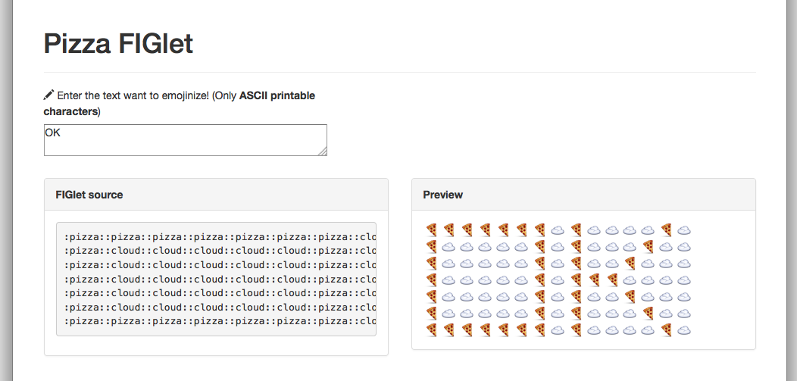

Pizza FIGlet
=============

Making large letters out of :pizza:



Requirements
--------------------

* [Node.js](http://nodejs.org)
    - `$ brew install node` on OS X


### Special Thanks

- [Vue.js](http://vuejs.org/)
- [patorjk/figlet.js](https://github.com/patorjk/figlet.js)


Getting started
--------------------

1. Installation:

    ```
    $ git clone https://github.com/gongo/pizza-figlet.git
    $ cd pizza-figlet
    $ npm install
    ```

1. Run server:

    ```
    $ npm start
    ```

1. Access to [http://localhost:8080/](http://localhost:8080)

License
--------------------

MIT License.
